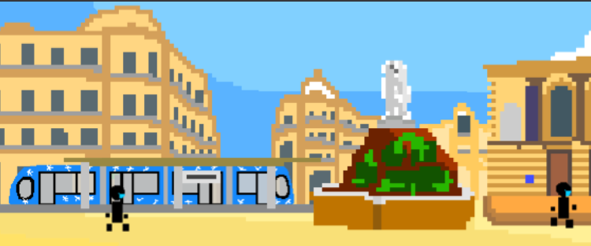

# Attestation, S’il Vous Plaît

<div style="text-align: center">
   
<div>A web-based game built with <b>Excalibur.js</b>, <b>Vite</b>, and <b>TypeScript</b>.</div>

</div>

---

## 🎯 Purpose

Step into the shoes of a French police officer stationed at the iconic Place de la Comédie in Montpellier during the
COVID-19 pandemic. In this 2D game inspired by "Papers Please", your job is to control pedestrians and verify their
documents: travel certificates, ID cards, ...
Your task is to spot inconsistencies, errors, and fraudsters while avoiding too many mistakes, or risk facing penalties.
Live unique Mediterranean atmosphere of Montpellier on famous "Place de la Comédie", with its trams, closed terraces,
and mandatory masks.
"Attestation, S’il Vous Plaît" is a game where every detail matters, and a single mistake can change everything.


## 💬 Context

This game was created in Global Game Jam 2026.


> Official GGJ website: https://globalgamejam.org/games/2026/attestation-sil-vous-plait-3

---

## 📋 Requirements

To build and run this project, you need:

- **Node.js** (v20 or higher recommended)
- **pnpm** (preferred package manager) or **npm**
- A modern web browser

---

## 🛠 Build and Development

### Local Installation

1. Clone the repository:
   ```bash
   git clone <repository-url>
   cd excalibur-template-ts-vite
   ```

2. Install dependencies:
   ```bash
   pnpm install
   ```

### Development Server

Run the development server with hot-reload:

```bash
pnpm dev
```

The application will be available at `http://localhost:5173`.

### Production Build

Compile and minify for production:

```bash
pnpm build
```

The output will be generated in the `dist/` directory.

---

## 🐳 Docker Build

You can containerize the application using the provided Dockerfile.

### Build the Image

Run the following command from the project root:

```bash
docker build -t covid-please -f deployment/Dockerfile .
```

### Run the Container

```bash
docker run -p 3000:8080 --rm -it covid-please
```

---

## ⚖️ License

This project is licensed under the **GNU General Public License v3.0 (GPL-3.0)**.

> This program is free software: you can redistribute it and/or modify it under the terms of the GNU General Public
> License as published by the Free Software Foundation, either version 3 of the License, or (at your option) any later
> version.

See the [GNU General Public License](https://www.gnu.org/licenses/gpl-3.0.en.html) for more details.